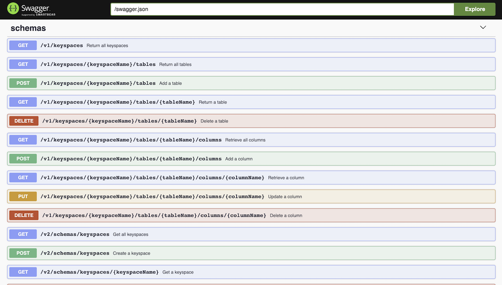
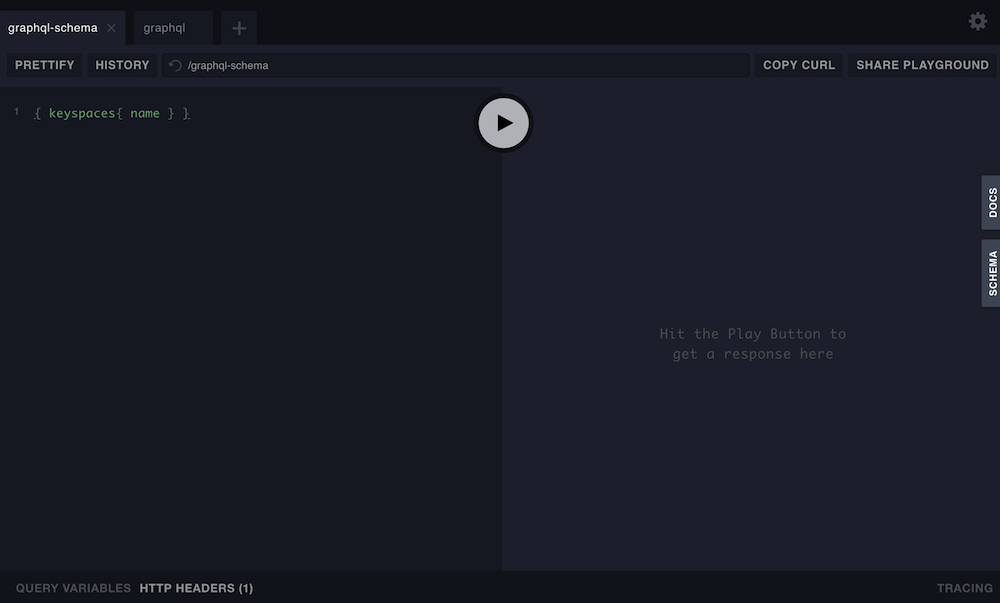

# Run Stargate on Cassandra using Docker Compose

## Start Cassandra and Stargate
The `docker-compose.yml` has been configured as such to allow for a gracefull startup of all nodes and finally Stargate.  
It uses the docker compose healtcheck which checks for the amount of Cassandra nodes being up and running in a healthy way (no start up, no range movement).
```sh
docker-compose up -d
```

## Check that everything is running
Use `nodetool` to check the health of the system. You should see four nodes running.
```sh
docker exec -it `docker ps | grep backend-1 | cut -b 1-12` nodetool status
```

## Stargate port mapping
Stargate is started with the following port mappings:
|Port|Service|
|----|-------|
|8080|GraphQL interface for CRUD|
|8081|REST authorization service for generating tokens|
|8082|REST interface for CRUD|
|9042|Native transport port (CQL, drivers)|

All ports available on `localhost`.

## Log in to cqlsh on the Cassandra container
Local `cqlsh` can be downloaded from https://docs.datastax.com/en/install/6.7/install/installCqlsh.html
```sh
docker exec -it backend-1 cqlsh
```
or
```sh
cqlsh localhost 9042
```

## Access the Stargate Swagger UI
To access the Swagger UI, open http://localhost:8082/swagger-ui in your browser.  



## Access the Stargate GraphQL playground
To access the GraphQL UI, open http://localhost:8080/playground in your browser.  



## Example using CURL: Generate an auth token
```sh
curl -L -X POST 'http://localhost:8081/v1/auth' -H 'Content-Type: application/json' --data-raw '{
    "username": "cassandra",
    "password": "cassandra"
  }'
```

# Using Stargate on Astra and locally
This part is all about how to use the REST, Document and GraphQL API's with Cassandra. 

For accessing the endpoints, Postman (https://www.postman.com) will be used, for which `collection` and `environment` definitions are provided.

The files in this repository are inspired on the work done by Dave Joy, see: https://www.youtube.com/watch?v=SU3Z4msZaDU.

## Differences in URL postfixes between Astra and locally
First of all it is important to note that the URLs of the Stargate endpoints, apart from the hostname of course, are a bit different. As follows:

|API|Astra URL postfix|Local URL postfix|
|---|-----|-----|
|REST and Document|/api/rest|:8082|
|GraphQL|/api|:8080|
|Authorization|/api/rest|:8081|

For this reason two separate environment definitions are provided:
- Local Stargate (fully configured): `Local Stargate.postman_environment.json`
- Astra (needs configuring): `Astra.postman_environment.json`

In order to use these defintions just load them into Postman.  

### When using Astra instead of local
For Astra, make sure you configure the following variables:
- hostname
- username
- password

## Load the collections of API calls
In order to load the collection of API calls to play with the endpoints, load `Stargate Access.postman_environment.json`.